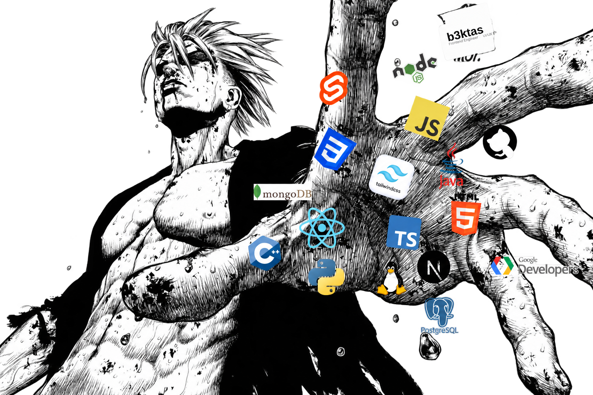

# b3ktas

<table width="100%">
<tr>
<td width="60%" valign="top">

### About

Hello , I'm a Product Engineer based in France. I enjoy building intuitive, performant, and maintainable interfaces with a strong focus on user experience.

I create reusable, data-driven components with clear architecture, predictable interactions, and real application states.

</td>

<td width="40%" align="right" valign="middle">

</td>
</tr>
</table>